# IoT Network Infrastructure with ANN-based IDS

> **SecurIoT AI** — Real-time cyberattack detection for IoT networks, backed by an Artificial Neural Network (ANN) Intrusion Detection System.

This repository hosts the networking lab and supporting documentation for a project that designs and validates an IoT network infrastructure enhanced with an Artificial Neural Network (ANN) Intrusion Detection System (IDS). The lab is built in **Cisco Packet Tracer** and exercises every layer relevant to an IoT deployment: LAN/VLSM addressing, inter-site routing, secure site-to-site communication (IPSec VPN), central services (FTP, HTTP), and an end-user dashboard.

---

## 📑 Table of Contents

- [Overview](#overview)
- [Project Goals](#project-goals)
- [Network Architecture](#network-architecture)
- [Key Concepts Demonstrated](#key-concepts-demonstrated)
- [Repository Contents](#repository-contents)
- [Image Gallery (`/img`)](#image-gallery-img)
- [IP Addressing Plan](#ip-addressing-plan)
- [How to Open the Project](#how-to-open-the-project)
- [Author](#author)

---

## Overview

The project, branded **SecurIoT AI**, delivers a layered IoT network testbed used to:

1. **Model a multi-site IoT corporate network** — a headquarters (*Sede*) and a branch (*Sucursal*) connected through an ISP, with mirrored IT/HR/Admin/Vendas (Sales) areas on each site.
2. **Run critical services centrally** — a public web server that hosts the SecurIoT AI dashboard and an internal FTP server that distributes Cisco IOS images and configuration artefacts.
3. **Secure inter-site traffic** — an IPSec VPN tunnel between the Sede and Sucursal edge routers protects every packet that crosses the ISP.
4. **Detect attacks in real time** — an ANN-based IDS analyses network traffic to identify and classify threats, enabling proactive mitigation.

The marketing tagline used throughout the project is:

> *"Protege a sua infraestrutura com o nosso sistema avançado IDS baseado em Redes Neuronais Artificiais (ANN), projetado para identificar e neutralizar ameaças em ambientes de Internet das Coisas."* (PT)

---

## Project Goals

- **Design a scalable IoT network** using VLSM subnetting so each department has its own address space.
- **Implement secure site-to-site communication** via IPSec VPN tunnels between headquarters and the branch.
- **Deploy and validate supporting services** — HTTP (SecurIoT AI dashboard) and FTP (Cisco IOS distribution) — and confirm they are reachable from end users.
- **Provide a lab baseline** for training and evaluating an Artificial Neural Network that classifies normal vs. malicious network traffic flowing across the testbed.

---

## Network Architecture


The topology is split into **three logical zones**:

| Zone | Devices | Role |
|------|---------|------|
| **Sede (HQ)** | 2911 RH, 2911 Admin, 2911 Vendas switches (2960‑24TT) + PCs (PC1–PC6) | Headquarters network with Admin, HR (RH) and Sales (Vendas) departments. |
| **Sucursal (Branch)** | 2911 RH-suc1, 2911 Admin-suc1, 2911 Vendas-suc1, 2911 Admin-suc2 + mirrored switches/PCs (PC7–PC12) | Branch network mirroring the Sede structure, distributed across two floors (`sucursal1` / `sucursal2`). |
| **ISP / DMZ** | 2911 ISP, web server (`10.0.0.1`), File Server (`172.16.2.34`) | The transit provider and the public-facing services (web dashboard, FTP). |

### Edge addresses used for the IPSec VPN
- Sede WAN interface: `172.16.1.53` / `172.16.1.57`
- Sucursal WAN interface: `172.16.1.58`
- Loopback used by IPSec: `172.16.1.52/32`, `172.16.1.54`, `172.16.1.56/32`

### Servers
- **Web Server** — `10.0.0.1/24`, gateway `10.0.0.254`. Hosts the **SecurIoT AI** marketing/landing page used to expose the IDS offering.
- **File Server (FTP)** — `172.16.2.34/29`, gateway `172.16.2.38`. Authenticates users (`cisco` / `cisco`) and stores Cisco IOS images for the engineering team.

---

## Key Concepts Demonstrated

- **VLSM subnetting** — departments are carved out of the `172.16.0.0/16` space with masks such as `/27`, `/29` and `/32` to fit varying host counts.
- **DHCP vs. static addressing** — end-user PCs receive DHCP leases from departmental routers; servers use static IPs.
- **IPSec VPN (site-to-site)** — an ESP/tunnel with Pre-Shared Key, ISAKMP Phase 1 / Phase 2 policy, and a `VPN-MAP` crypto map applied to the WAN interface.
- **FTP service** — user `cisco` with `RWDNL` permissions (Read, Write, Delete, Rename, List) and the Cisco IOS images bundle.
- **HTTP service** — a custom `index.html` (dark theme, "SecurIoT AI" branding) served from the public web server.
- **End-to-end validation** — ping/FTP GET-PUT tests and the rendered web page confirm the design works.

---

## Repository Contents

```
iot-network-infrastructure-ann-ids/
├── README.md                  # This file
├── projRD2025.pkt             # Cisco Packet Tracer lab (open in Packet Tracer 8.x+)
├── .gitattributes             # Git line-ending normalisation
└── img/                       # Screenshots documenting the lab (see below)
```

The Packet Tracer file `projRD2025.pkt` is the **single source of truth** for the entire lab: topology, addressing, router/switch configurations, VPN, and the services running on the servers.

---

## Image Gallery (`/img`)

Every screenshot in `img/` is captured straight from the running Packet Tracer session. They double as a visual runbook of the project.

### 1. Network Architecture

**File:** `network architecture.png`
The complete topology showing the **Sede** (left), **Sucursal/sucursal1** (right), **sucursal2** (bottom), and the **ISP/DMZ** with the web server and File Server. Annotation boxes above the routers detail the VLSM math used per subnet (network, first/last host, broadcast). The red lines are the VPN/wan connections between edge routers (`172.16.1.52/32`, `172.16.1.53/32`, `172.16.1.56/32`, `172.16.1.54/32`).

### 2. IP Configuration — Sede HQ/HR PC
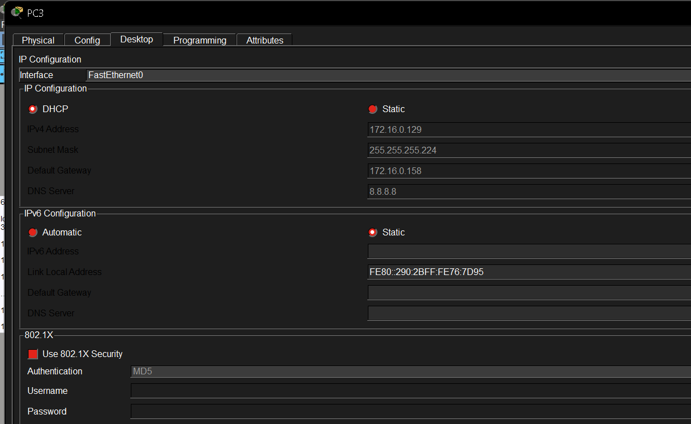
**File:** `pc3_hq_hr.png`
Static IP setup of **PC3** (Sede → HR/RH department): `172.16.0.129 / 255.255.255.224`, gateway `172.16.0.158`, DNS `8.8.8.8`. Confirms the `/27` subnet math used for the HQ HR LAN.

### 3. SecurIoT AI Website (rendered)
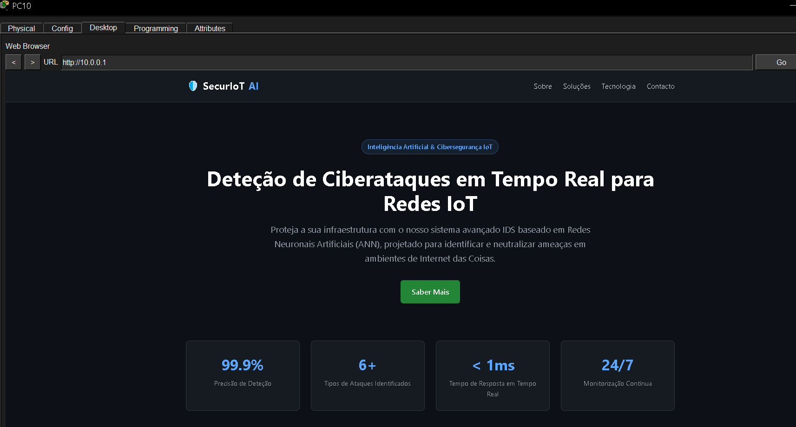
**File:** `site.png`
The **public website** hosted on the web server (`10.0.0.1`), accessed from PC10. The dark-themed landing page markets the ANN-based IDS, lists the marketing KPIs (99.9% accuracy, 6+ attack types, < 1 ms response, 24/7 monitoring) and shows the navigation menu (Sobre / Soluções / Tecnologia / Contacto).

### 4. Web Server IP Configuration
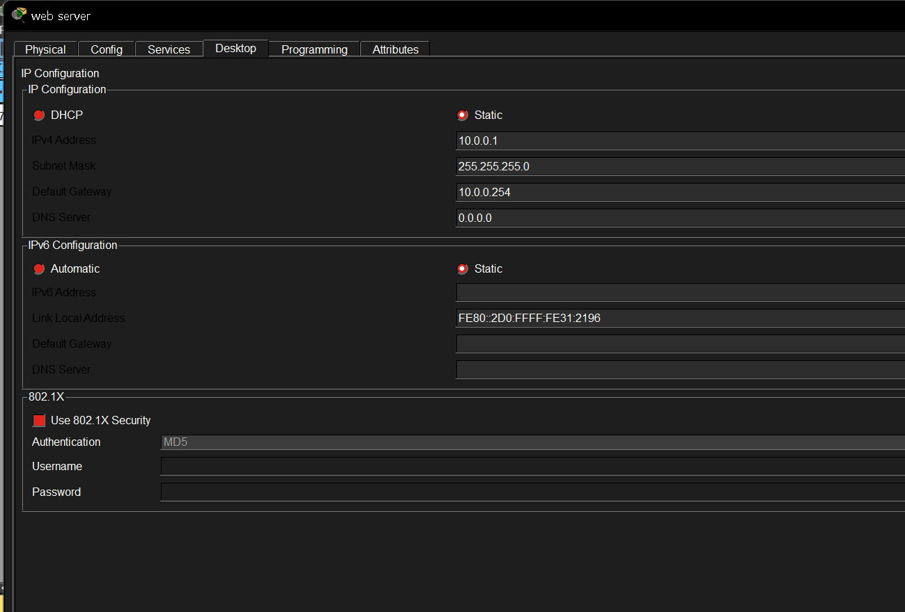
**File:** `web_server_confg.png`
Static config of the **web server**: `10.0.0.1 / 255.255.255.0`, gateway `10.0.0.254`. This is the public-facing HTTP endpoint that serves the SecurIoT AI dashboard.

### 5. Web Server Source File (`index.html`)
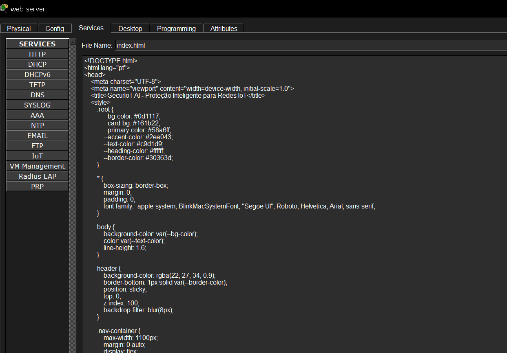
**File:** `web_server_site_file.png`
The Packet Tracer HTTP service editor showing the `index.html` source of the SecurIoT AI site. The page uses a CSS custom-property palette (`--bg-color #0d1117`, `--primary-color #58a6ff`, etc.) — the same dark theme rendered in `site.png`.

### 6. FTP Server IP Configuration
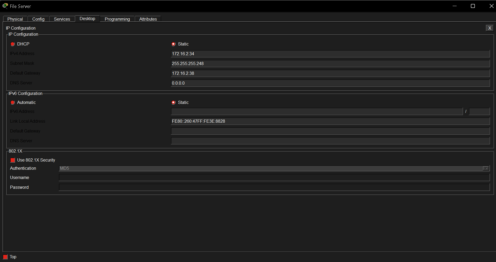
**File:** `ftp_server_addresses.png`
Static config of the **File Server** that hosts the FTP service: `172.16.2.34 / 255.255.255.248`, gateway `172.16.2.38`. Lives in the `172.16.2.32/29` subnet.

### 7. FTP Service — User & Permissions
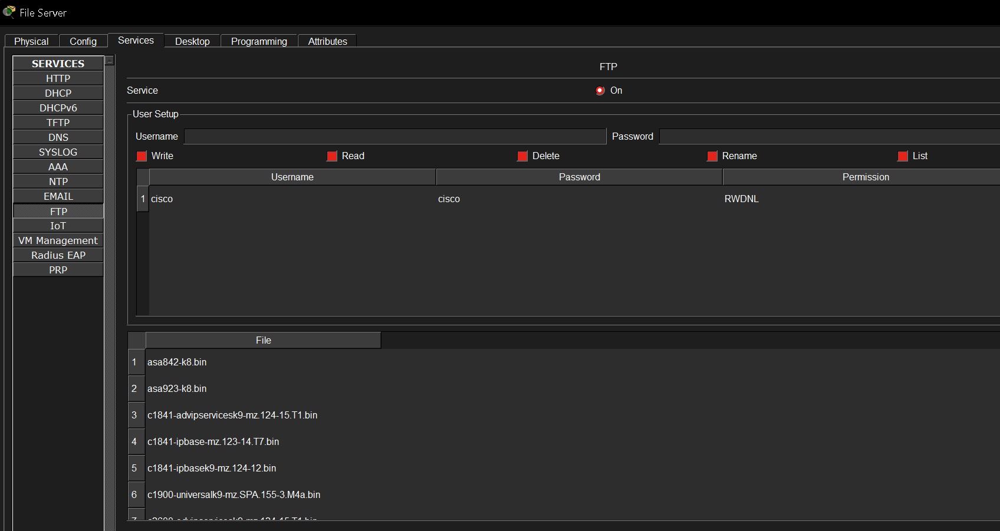
**File:** `ftp_cred_and_perm.png`
Packet Tracer **Services → FTP** panel. The service is **On**, the user `cisco` / `cisco` has been created with the full `RWDNL` permission set (Read, Write, Delete, Rename, List), and the file library shows Cisco IOS images and `test.txt`.

### 8. FTP Access from a Sede PC
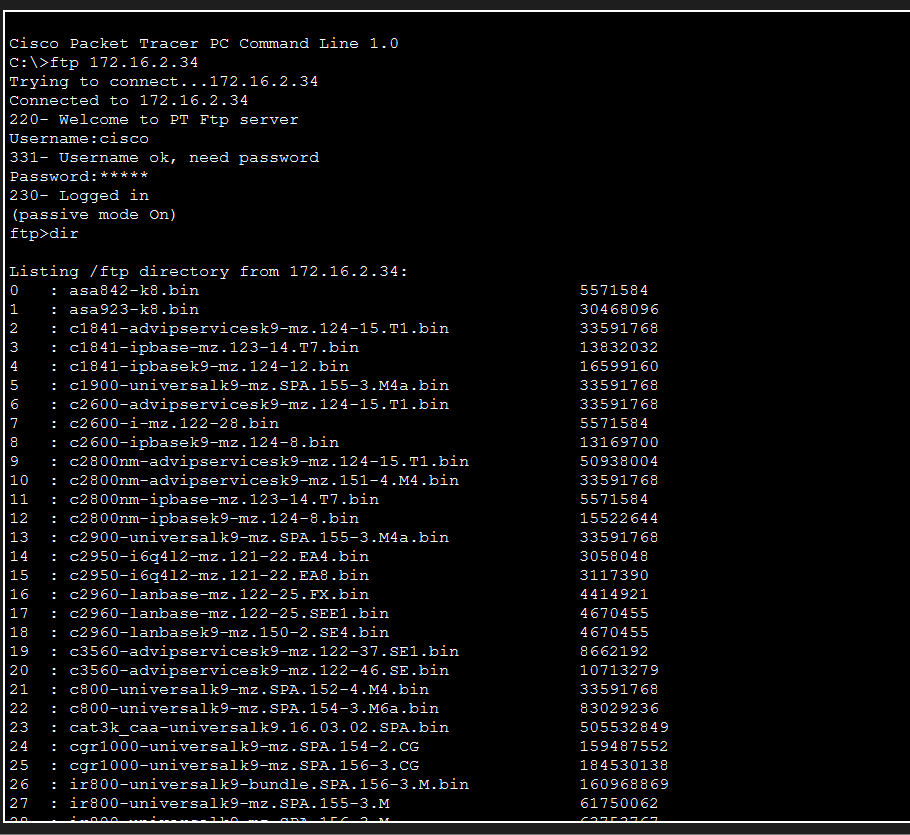
**File:** `ftp_server_access.png`
PC10 initiates `ftp 172.16.2.34`, logs in as `cisco`, runs `dir` and lists the available Cisco IOS bundles. Demonstrates that the FTP server is reachable from the Sede LAN.

### 9. FTP Upload (`test.txt`)
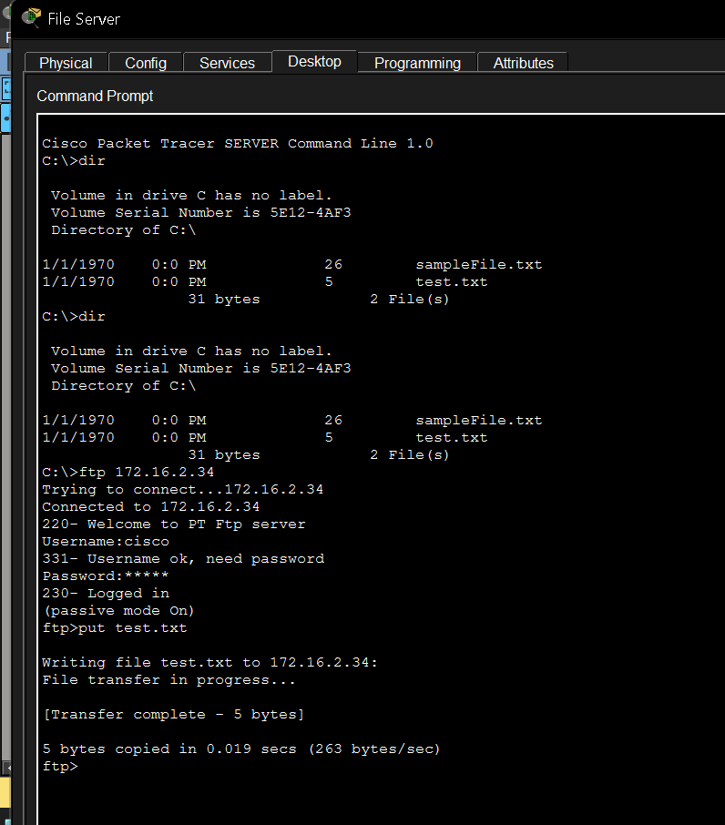
**File:** `upload_file_to_ftp.png`
The File Server's own command prompt performing an FTP upload: `ftp> put test.txt` → *Transfer complete — 5 bytes*. Validates that the write path is working.

### 10. FTP Download (`test.txt`)
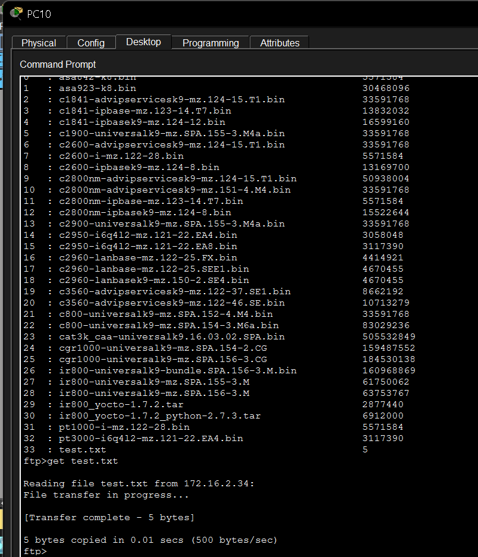
**File:** `download_file.png`
PC10 running `ftp> get test.txt` against `172.16.2.34` — *Transfer complete — 5 bytes*. Confirms the read path from the end-user side.

### 11. IPSec VPN — Sede Router (Part 1)
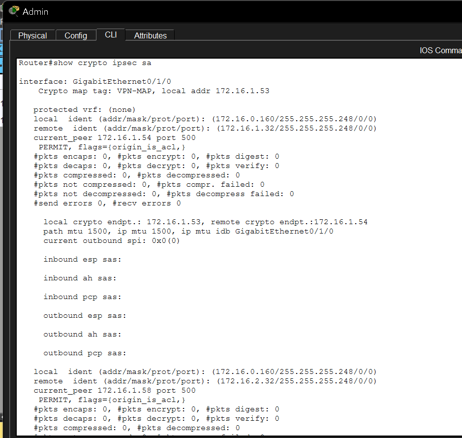
**File:** `ipsec_vpn_router_sede_pt1.png`
Output of `show crypto ipsec sa` on the **Sede** router for `GigabitEthernet0/1/0`. The crypto map `VPN-MAP` is bound to local address `172.16.1.53`, the ISAKMP peer is `172.16.1.54` (Sucursal's loopback), and the protected subnets are `172.16.0.160/29 ↔ 172.16.1.32/29`.

### 12. IPSec VPN — Sede Router (Part 2)
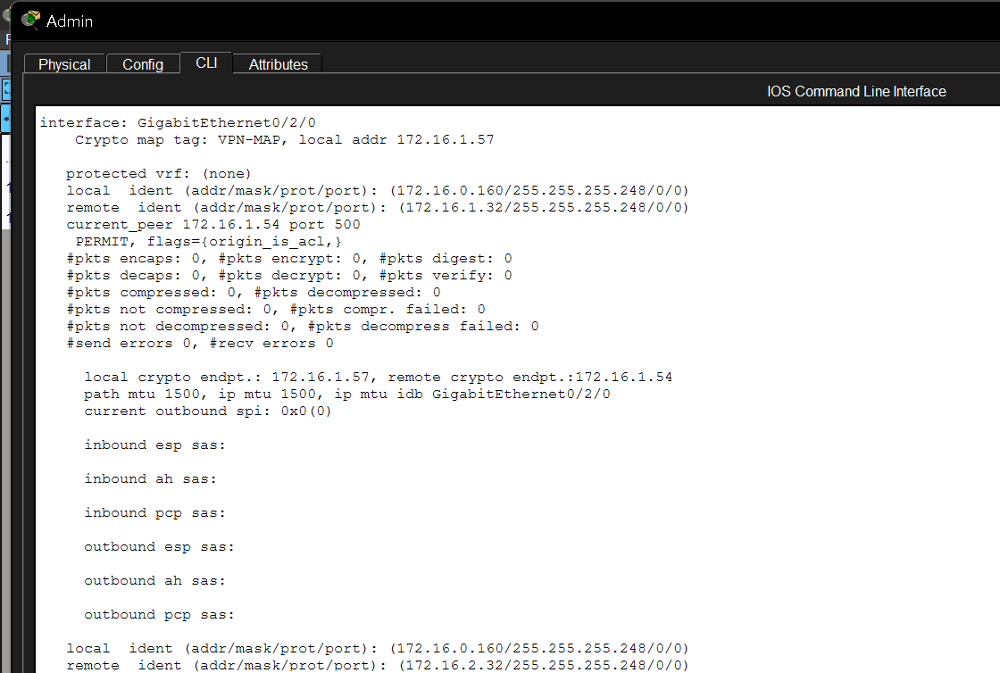
**File:** `ipsec_vpn_router_sede_pt2.png`
Continuation of the Sede's `show crypto ipsec sa`, this time for `GigabitEthernet0/2/0` (local `172.16.1.57`). Confirms the Phase-2 SAs are installed for both VPN endpoints.

### 13. IPSec VPN — Sucursal Router
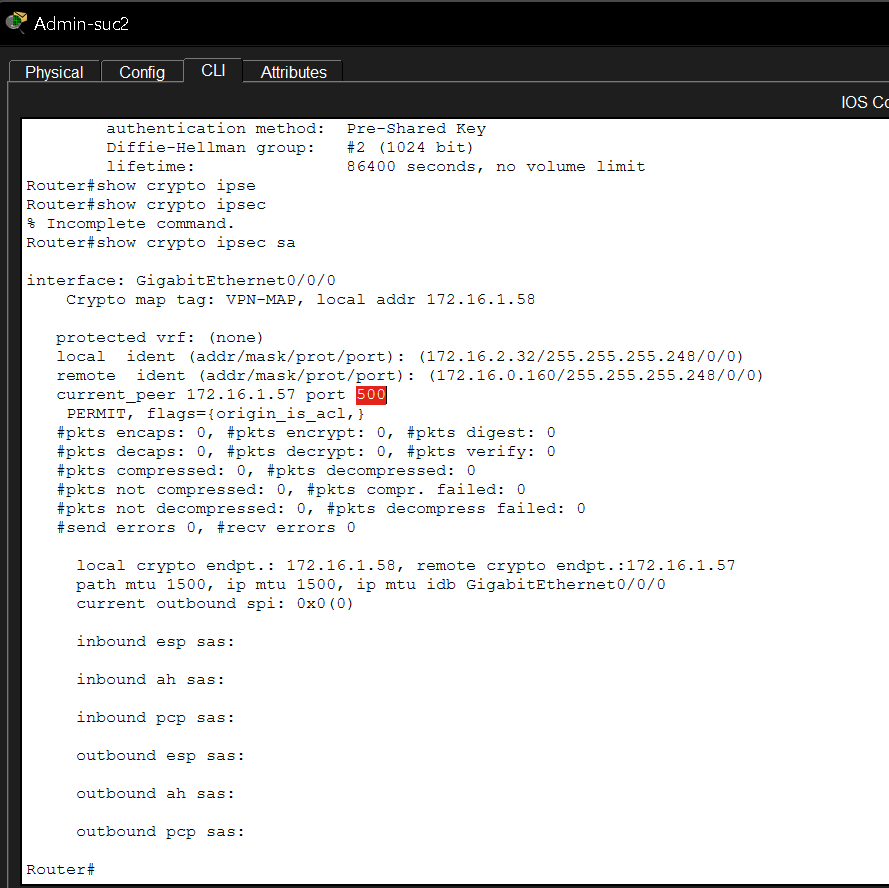
**File:** `ipsec_vpn_router_suc.png`
From the **Sucursal** side (`Admin-suc2`, `GigabitEthernet0/0/0`, local `172.16.1.58`). Shows the mirrored crypto map: peer `172.16.1.57`, protected subnets `172.16.2.32/29 ↔ 172.16.0.160/29`, Pre-Shared Key, Diffie-Hellman group 2, lifetime 86400 s. Verifies the tunnel is symmetric.

---

## IP Addressing Plan

The full VLSM layout is annotated on the architecture diagram. The relevant blocks:

| Subnet | Mask | Purpose | Sample host / gateway |
|--------|------|---------|-----------------------|
| `172.16.0.0/25` | 255.255.255.128 | Sede → Vendas | hosts `172.16.0.1` – `172.16.0.126`, broadcast `.127` |
| `172.16.0.128/27` | 255.255.255.224 | Sede → RH / HR | hosts `172.16.0.129` – `172.16.0.158`, gateway `.158` |
| `172.16.0.160/29` | 255.255.255.248 | Sede → Admin | hosts `172.16.0.161` – `172.16.0.166`, gateway `.167` |
| `172.16.1.0/27` | 255.255.255.224 | Sucursal1 → Vendas | hosts `172.16.1.1` – `172.16.1.30` |
| `172.16.1.32/29` | 255.255.255.248 | Sucursal1 → RH | hosts `172.16.1.33` – `172.16.1.38` |
| `172.16.1.40/29` | 255.255.255.248 | Sucursal1 → Admin | hosts `172.16.1.41` – `172.16.1.46` |
| `172.16.2.32/29` | 255.255.255.248 | Sucursal2 + File Server | hosts `172.16.2.33` – `.38`, File Server `172.16.2.34` |
| `172.16.1.52/32`, `172.16.1.54/32`, `172.16.1.56/32` | /32 | IPSec loopbacks / endpoints | routers `172.16.1.53`, `172.16.1.57`, `172.16.1.58` |
| `10.0.0.0/24` | 255.255.255.0 | DMZ — Web Server | web server `10.0.0.1`, gateway `10.0.0.254` |

> Tip: the subnet math shown in the diagram is computed as `log2(66) ≈ 6.04 ⇒ 7 host bits ⇒ 20 hosts + 2 ends` then rounded up per requirement.

---

## How to Open the Project

1. Install **Cisco Packet Tracer 8.x** (or newer).
2. Clone this repository:
   ```bash
   git clone https://github.com/<your-user>/iot-network-infrastructure-ann-ids.git
   ```
3. Open `projRD2025.pkt` in Packet Tracer.
4. Switch to **Realtime** / **Simulation** mode and explore the topology.
5. Cross-reference each step with the matching screenshot in `/img`.

### Quick verification checklist
- From PC10 → `ftp 172.16.2.34` (login `cisco` / `cisco`) → `dir` lists the IOS bundles.
- From PC10 → `ftp> put` and `ftp> get` a small file (`test.txt`).
- From PC10 → open `http://10.0.0.1` in the Web Browser to view the SecurIoT AI page.
- On the Sede router → `show crypto ipsec sa` shows the active SAs described in images #11–#13.

---

## Author

Project maintained by **Jose Branco** · IPLeiria · curricular unit focused on network infrastructure design and IoT cybersecurity.

Contributions, suggestions and security reviews are welcome — open an issue or submit a pull request.
